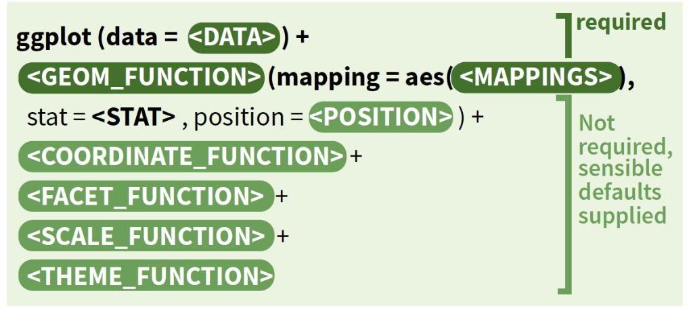
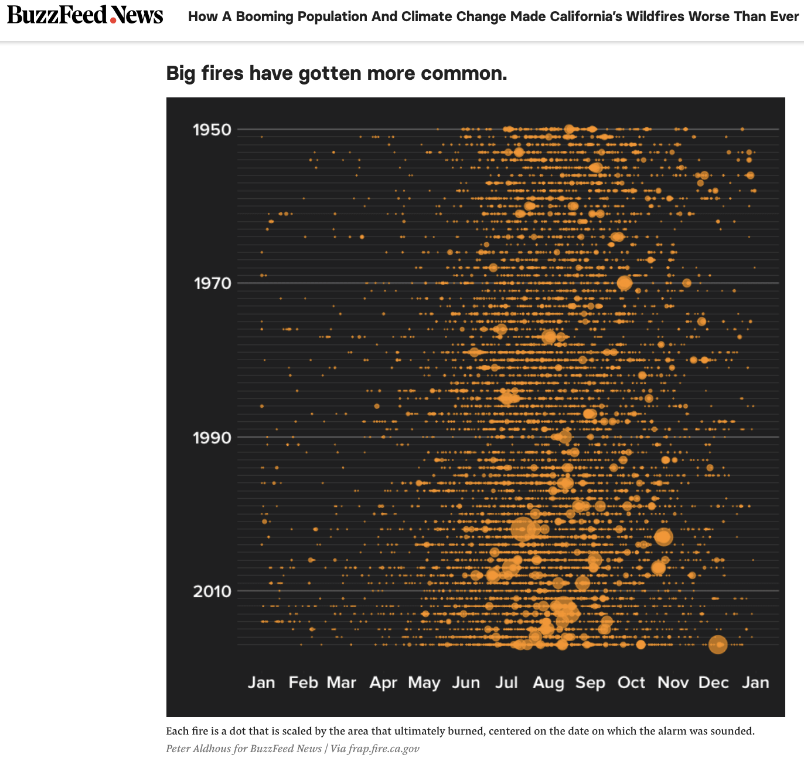

The goal of this lab is to explore and visualize wildfire trend data using ggplot, plotly, and shiny. Parts of this lab are based on this [Jul. 28, 2018 BuzzFeed News post on wildfires](https://www.buzzfeednews.com/article/peteraldhous/california-wildfires-people-climate). The code and data to make the plots can be found in [this GitHub repository](https://github.com/BuzzFeedNews/2018-07-wildfire-trends).

We recommend using an RStudio Project (File -> New Project... -> New Directory) and create a folder that data and scripts can live.

Prior to the lab session please install required packages (see code below), download the data sets, [set up a free online Plot.ly account](https://plot.ly) and setup your working directory or RStudio Project.

```{r packages , message = F, warning=F}
# install.packages("ggplot2")
# install.packages("dplyr")
# install.packages("readr")
# install.packages("lubridate")
# install.packages("data.table")
# install.packages("plotly")

library(ggplot2)
library(dplyr)
library(readr)
library(lubridate)
library(data.table)
library(plotly)
```

##Part I: Data visualization with ggplot2
ggplots are built in layers. The only required components are: the initial ggplot() call and a geom() call with aesthetic (aes()) properties. Refer to the ggplot2 cheat sheet at https://ggplot2.tidyverse.org/ for more information on different functions. 
Below is an overview of the different categories of functions used to make ggplots:



####Base plot vs. ggplot
To explore the functionality of ggplot, we will use the included diamonds data set and compare simple plots made with base plotting and ggplot. First, look at the structure of the data to see what types of variables we are working with.

```{r , eval = F}
str(diamonds)
```

How would we make a scatterplot using base plot?
```{r}
plot(diamonds$carat,diamonds$price)
```

And in ggplot:
```{r}
ggplot(data=diamonds) + 
  geom_point(aes(x = carat, y = price))
```

This simple plot has the diamonds dataset in the data layer, and carat and price assigned to the x and y aesthetic respectively. The geom here is geom_point, and results in a scatterplot.

These plots are pretty ugly - there is a lot of overplotting, and we may be able to take advantage of another channel (color) to explore another aspect of this dataset. Here is where ggplot quickly becomes more intuitive and prettier than base plotting. To illustrate this, add clarity to the color and jitter points. For ggplot, mappings added within aes will create a legend, those outside the aes() will not.

```{r}
ggplot(data = diamonds) + 
  geom_point(aes(x = carat, y = price, color = clarity), alpha = 0.3, position = "jitter")
```

Much better!

But if we try base plotting:
```{r}
plot(jitter(diamonds$carat),diamonds$price, col=diamonds$clarity, pch = 19)
```

...Gross.


**Task: Create another scatterplot using the mpg dataset. Plot cty on the x, hwy (highway mileage) on the y. color by class**

Tip: use str(mpg) to get information about the dataset.


####ggplot layers (geoms, facets, stats, etc.)
The only required components of a ggplot is the data and the aesthetic mappings. Additional layers (facets, statistics, coordinates, themes) help with customizing your plot and visualizing additional information.

The layer I have found most useful in ggplot is the facet layer. 
Use facet_wrap to make subplots of the dataset for different cut types. Tip: Use nrow or ncol within facet_wrap if you want to set how many rows/columns the subplots should break into.

```{r , eval = F}
ggplot(data = diamonds) + 
  geom_point(aes(x = carat, y = price, color = clarity), alpha = 0.3, position = "jitter")+
  facet_wrap(.~cut)
```

**Task: Make another plot with an added facet wrap layer. Facet wrap by clarity instead of cut. Have the output have only 2 rows of plots.**

Now add a statistics layer by adding a smoothed line to better see the pattern in the dataset. Change the theme by adding a theme layer. Add labels.
```{r, message = F}
ggplot(data = diamonds, aes(x = carat, y = price)) + 
  geom_point(aes(color = clarity), alpha = 0.3, position = "jitter")+
  geom_smooth()+
  facet_wrap(.~cut)+
  theme_classic() + 
  labs(
    title = "Diamond (data) Mine",
    y = "Price (US $)",
    x = "Carat"
  )

```

Note that x = carat and y = price moved up into the ggplot() call. This means that those aesthetics will be used in any other functions called (in this case geom_point and geom_smooth).

***

##Part II: Exploring trends in wildfires
Next, we will work with the wildfire data used in the Buzzfeed post. We will work to create an image similar to this one featured in the article.




To start, load and filter the data. This data preparation section will be used in other parts of the lab (plotly, shiny). We will just be working with fires from California (CA) that are bigger than 1000 acres.
```{r data.prep, message=F, warning =F}
files <- list.files("data/us_fires") #change path if not working in project or directory with data folder

us_fires <- data_frame()

for (f in files) {
  tmp <- read_csv(paste0("data/us_fires/",f), col_types = cols(
    .default = col_character(),
    stat_cause_code = col_double(),
    cont_date = col_datetime(format = ""),
    discovery_date = col_datetime(format = ""),
    cont_doy = col_integer(),
    cont_time = col_integer(),
    fire_size = col_double(),
    latitude = col_double(),
    longitude = col_double()
  ))
  us_fires <- bind_rows(us_fires,tmp)
}
rm(tmp)

# assign fires to main causes
us_fires <- us_fires %>%
  mutate(cause = case_when(stat_cause_code == 1  ~ "Natural",
                           stat_cause_code == 13 | is.na(stat_cause_code) ~ "Unknown",
                           stat_cause_code >= 2 | stat_cause_code <= 12 ~ "Human"),
         date = as.Date(case_when(is.na(discovery_date) ~ cont_date,
                                  !is.na(discovery_date) ~ discovery_date)))

#filter data to just California
ca_fires<-filter(us_fires, state == "CA" & fire_size>1000)

#add column called plot_date to help with plotting the data
ca_fires<-ca_fires %>%
  mutate(plot_date = as.Date(format(date,"2017-%m-%d")))
```

Note: status bar may only pop up for a few of the files, but all files should have been processed.

For the remainder of the lab we will be working with the just the ca_fires dataset.

Let's first get an idea of the distribution of the wildfire data. Use geom_point to make a map of the data by plotting longitude to x, latitude to y, cause to color, and fire size to point size.
```{r}
ggplot(data = ca_fires)+
  geom_point(aes(x = longitude, y = latitude, color = cause, size = fire_size))+
  scale_size_area(max_size = 10, guide = FALSE)+
  coord_equal()+
  theme_classic()
```

Since ggplots are built on layers, you could call ggplot() + geom_polygon(name of polygon data) + geom_point(data = point data, aes()) to create quick maps of your data. Just think about where your data is going (if inside ggplot call, your layers will only access that dataset).

Construct a bar chart showing different types of fires by fire cause.
```{r}
ggplot(data = ca_fires)+
  geom_bar(aes(x = cause, fill = stat_cause_descr), position = "fill")+
  theme_classic()
```

Now we will make a bubble plot showing fire size throughout the year (like the one from the original Buzzfeed article). First we will create a plot template. This template can be reused to make the same type of plot with different properties of your data on it.
```{r}
plot_template_ca <- ggplot(ca_fires, aes(y=as.numeric(fire_year))) +
  geom_hline(yintercept = seq(1992, 2015, by = 1), color = "gray", size = 0.05) +
  scale_size_area(max_size = 10, guide = FALSE) +
  scale_x_date(date_breaks = "months", date_labels = "%b") +
  scale_y_reverse(limits = c(2015,1992), breaks = c(2010,2005,2000,1995)) +
  xlab("") +
  ylab("") 

ca_bubble<- plot_template_ca +
  geom_point(aes(size = fire_size, x = plot_date, color = cause),alpha=0.5)

ca_bubble

```

Facet wrap by cause:
```{r}
plot_template_ca +
  geom_point(aes(size = fire_size, x = plot_date,color = cause),alpha=0.5)+
  facet_wrap(.~cause)
```

That's it for a basic introduction to data visualization with ggplot in R! Refer to the resources at the bottom of the page to explore additional functionality, including using ggplot to map with sf (simple features) objects! 

Now on to plotly!

***

##Part III: Plotly in R - Extending ggplotly!
**Note: RStudio may crash** without warning when interacting with Plotly elements in the RStudio view. If this happens, reopen RStudio and reload the libraries and data. If it continues to happen, limit your interaction with Plotly elements in RStudio and use instead the web-publishing option, api_create() described in the animation portion of this section. You may also try updating to a newer version of RStudio, which reportedly fixes the issue. 

Use the filtered ca_fires dataset to remake the bubble regime chart. 
```{r}
ca_bubble<- plot_template_ca +
  geom_point(aes(size = fire_size, x = plot_date, color = cause),alpha=0.7)
```

Let's make our first ggplotly:
```{r}
ggplotly(ca_bubble)
```


It's got a lot of functionality right out of the box. But it's not exactly customized to our data. 

First, let's customize the hover text. To do that, we need to add an unofficial text aesthetic ggplot object. It recognizes html line breaks to make your labels look awesome! Ignore the warning message about the text aesthetic in the geom_point function. The tooltip argument of ggplotly is what calls the text argument. 
```{r, warning=F}
ca_bubble2 <- plot_template_ca +
  geom_point(aes(size = fire_size, x = plot_date, color = cause, group = 1, text=paste('Name:', mtbs_fire_name, '<br>Cause:', cause)), alpha=0.7)

ggplotly(ca_bubble2, tooltip = "text")
```


**Task: Add discover and control dates (or anything else you think is interesting) to labels on your own. If you want to be really fancy, calculate fire duration and add that to hover text!** (HINT: difftime()).

```{r, warning=F}
ca_fires$duration_days<-difftime(ca_fires$cont_date, ca_fires$discovery_date, units="days")

plot_template_ca <- ggplot(ca_fires, aes(y=as.numeric(fire_year))) +
  geom_hline(yintercept = seq(1992, 2015, by = 1), color = "gray", size = 0.05) +
  scale_size_area(max_size = 10, guide = FALSE) +
  scale_x_date(date_breaks = "months", date_labels = "%b") +
  scale_y_reverse(limits = c(2015,1992), breaks = c(2010,2005,2000,1995)) +
  xlab("") +
  ylab("")

ca_bubble3 <- plot_template_ca +
  geom_point(aes(size = fire_size, x = plot_date, color = cause, group = 1, text=paste('Name:', mtbs_fire_name, '<br>Cause:', cause, '<br>Duration:', duration_days, "days", '<br>Descr:', stat_cause_descr)), alpha=0.7)

g<-ggplotly(ca_bubble3, tooltip = "text", dynamicTicks = T)
#g<-ggplotly(ca_bubble3, tooltip = "text")
g
```


Let's add a range slider.
```{r}
rangeslider(g)
```
That's kind of terrible for this type of graph - when might it be useful?

###Animating ggplotly
In your online plot.ly account you'll find a tab with your API keys. Set them in your R environment: 

```{r, echo = F}
Sys.setenv("plotly_username"="swricci")
Sys.setenv("plotly_api_key"="LJSpcq9tYuOX9ucM31lv")
```

```{r eval = F}
Sys.setenv("plotly_username"="your-username")
Sys.setenv("plotly_api_key"="your-api")
```


To designate the variable to animate, we'll go back again to the original ggplot object and use another unofficial aesthetic, frame. 
```{r, warning=F}
ca_bubble4 <- plot_template_ca +
  geom_point(aes(frame=as.numeric(fire_year), size = fire_size, x = plot_date, color = cause, group = 1, 
                 text=paste('Name:', mtbs_fire_name, '<br>Cause:', cause, '<br>Duration:', duration_days, 'days')),
              alpha=0.7)

g<-ggplotly(ca_bubble4, tooltip = "text")

```


Api_create() should create a web-based animation accessible via your plot.ly account. A browser window should automatically open. 
```{r, eval=F}
g %>%
  animation_opts(1000, transition=500, easing="linear")
chart_link = api_create(g, filename="plotly-lab-an")
chart_link

```


**Try on your own: animate by month (use month() to extract month from date field) or cause, play with some of the other options [in opts and in animation_slider() and animation_button()](https://www.rdocumentation.org/packages/plotly/versions/4.8.0/topics/animation_opts)** (Some example code below.)


```{r, eval=F}
ca_bubble5 <- plot_template_ca +
  geom_point(aes(frame=cause, size = fire_size, x = plot_date, color = cause, group = 1, 
                 text=paste('Name:', mtbs_fire_name, '<br>Cause:', cause, '<br>Duration:', duration_days, 'days')),
             alpha=0.7)

g<-ggplotly(ca_bubble5, tooltip = "text")


a<- g %>%
  animation_opts(frame=2000, transition=500, easing="elastic", mode="next")
chart_link = api_create(a, filename="plotly-lab-an")
chart_link
```


###Linking views with Plotly in R

It's easy to link views using facet wrap. Have we told you how much we love facet wrap?
```{r}
f<- ca_bubble3 +
  facet_wrap(.~cause)

ggplotly(f, tooltip="text", dynamicTicks=T)
```

You can also link multiple different kinds of ggplots with the highlighting function. To do this, hightlight the original dataset, then remake the ggplots with that dataset. We'll make a density plot to go with our bubble plot. 

```{r, warning=F}
n <- highlight_key(ca_fires, ~cause)

p1 <- ggplot(n, aes(x=plot_date, fill = cause)) + 
  geom_density(alpha=0.7, colour=NA) +
  scale_x_date(date_breaks = "months", date_labels = "%b") +
  scale_y_continuous(position = "right")

plot_template_highlight <- ggplot(n, aes(y=as.numeric(fire_year))) +
  geom_hline(yintercept = seq(1992, 2015, by = 1), color = "gray", size = 0.05) +
  scale_size_area(max_size = 10, guide = FALSE) +
  scale_x_date(date_breaks = "months", date_labels = "%b") +
  scale_y_reverse(limits = c(2015,1992), breaks = c(2010,2005,2000,1995)) +
  xlab(month(ca_fires$plot_date)) +
  ylab("") 


p2 <- plot_template_highlight +
  geom_point(aes(size = fire_size, x = plot_date, color = cause, group = 1, 
                 text=paste('Name:', mtbs_fire_name, '<br>Cause:', cause, '<br>Duration:', duration_days, 'days')),
             alpha=0.7)
```


The subplot() function links these plots in a single view in your RStudio. 
```{r}
subplot(p2, p1) %>% hide_legend() %>% highlight("plotly_click")
```

**Task: Link a 3rd chart, such as the time series of fire area. OR, change the highlight key to year.**

This is only scratching the surface of linking views for interactive dashboards. Stay tuned for Module 2 of this workshop on Wednesday for applications in Shiny and Dash. 


##References and Resources
[ggplot2 documentation](https://ggplot2.tidyverse.org/) 

[ggplot2 & sf](https://www.r-spatial.org/r/2018/10/25/ggplot2-sf.html)

NC State Libraries [Data Visuzalization with R](go.ncsu.edu/dvr-slides)

DataCamp [Data Visualization with ggplot2](https://www.datacamp.com/courses/data-visualization-with-ggplot2-1) 

Plot.ly documentation is [available here](https://plot.ly/r)
